# Praktikum 1: Dasar State dengan Model-View

Membuat projek baru master_plan

Membuat model task.dart

Membuat file plan.dart didalam folder models

Membuat file data_layer.dart,Kita dapat membungkus beberapa data layer ke dalam sebuah file yang nanti akan mengekspor kedua model tersebut. Dengan begitu, proses impor akan lebih ringkas seiring berkembangnya aplikasi

Mengubah isi kode main.dart seperti berikut 

Membuat file plan_screen.dart pada folder views 

Membuat method _buildAddTaskButton() didalam plan_screen.dart

Kemudian buat widget _buildList() juga didalam file tersebut

Kemudian buat widget _buildTaskTile

Pada saat saya jalankan hasilnya seperti berikut 

Tambah Scroll Controller
Anda dapat menambah tugas sebanyak-banyaknya, menandainya jika sudah beres, dan melakukan scroll jika sudah semakin banyak isinya. Namun, ada salah satu fitur tertentu di iOS perlu kita tambahkan. Ketika keyboard tampil, Anda akan kesulitan untuk mengisi yang paling bawah. Untuk mengatasi itu, Anda dapat menggunakan ScrollController untuk menghapus focus dari semua TextField selama event scroll dilakukan. Pada file plan_screen.dart, tambahkan variabel scroll controller di class State tepat setelah variabel plan.

Tambah ScrollController di initState() dengan listener

Menambahkan controller dan keyboard behavior pada ListView di method _buildList

Terakhir, tambahkan method dispose() berguna ketika widget sudah tidak digunakan lagi.

Berikut hasil setelah dijalankan 

# Tugas Praktikum 1
Selesaikan langkah-langkah praktikum tersebut, lalu dokumentasikan berupa GIF hasil akhir praktikum beserta penjelasannya di file README.md! Jika Anda menemukan ada yang error atau tidak berjalan dengan baik, silakan diperbaiki.
1. Jelaskan maksud dari langkah 4 pada praktikum tersebut! Mengapa dilakukan demikian? Langkah ini dilakukan agar layar bisa merespons perubahan data secara real-time melalui mekanisme state management Flutter.
2. Mengapa perlu variabel plan di langkah 6 pada praktikum tersebut? Mengapa dibuat konstanta ? Variabel plan dibuat agar dapat menyimpan daftar tugas dalam satu rencana tertentu, dan menggunakan final menjaga agar objeknya konsisten selama aplikasi berjalan.
3. Lakukan capture hasil dari Langkah 9 berupa GIF, kemudian jelaskan apa yang telah Anda buat! Pada langkah ini, aplikasi menampilkan daftar plan yang bisa ditambahkan oleh pengguna.
Setiap plan dapat diberi tanda centang untuk menandakan bahwa tugas tersebut sudah selesai.
4. Apa kegunaan method pada Langkah 11 dan 13 dalam lifecyle state ? Method ini digunakan untuk menyiapkan data atau controller sebelum widget ditampilkan.

# Praktikum 2: Mengelola Data Layer dengan InheritedWidget dan InheritedNotifier

Membuat folder baru provider pada folder lib kemudian membuat file di dalam folder tersebut plan_provider.dart

Mengedit main.dart 
Mengganti pada bagian atribut home dengan PlanProvider seperti berikut. 

Menambahkan dua method di dalam model class Plan

Edit PlanScreen agar menggunakan data dari PlanProvider. Hapus deklarasi variabel plan (ini akan membuat error). Kita akan perbaiki pada langkah 5 berikut ini. 

Edit method _buildAddTaskButton Tambahkan BuildContext sebagai parameter dan gunakan PlanProvider sebagai sumber datanya

Menambahkan parameter BuildContext, gunakan PlanProvider sebagai sumber data. Ganti TextField menjadi TextFormField untuk membuat inisial data provider menjadi lebih mudah

Mengedit build list Sesuaikan parameter pada bagian _buildTaskTile

Edit method build sehingga bisa tampil progress pada bagian bawah (footer). Caranya, bungkus (wrap) _buildList dengan widget Expanded dan masukkan ke dalam widget Column 

Terakhir, menambahkan widget SafeArea dengan berisi completenessMessage pada akhir widget Column.

# Tugas Praktikum 2 

1. Selesaikan langkah-langkah praktikum tersebut, lalu dokumentasikan berupa GIF hasil akhir praktikum beserta penjelasannya di file README.md! Jika Anda menemukan ada yang error atau tidak berjalan dengan baik, silakan diperbaiki sesuai dengan tujuan aplikasi tersebut dibuat.
2. Jelaskan mana yang dimaksud InheritedWidget pada langkah 1 tersebut! Mengapa yang digunakan InheritedNotifier? InheritedWidget adalah kelas dasar di Flutter yang digunakan untuk mewariskan data atau state ke seluruh widget turunannya tanpa perlu mengoper parameter secara manual, InheritedNotifier adalah turunan dari InheritedWidget yang lebih efisien, karena ia secara otomatis memberi tahu (notify) widget turunan hanya ketika data (notifier) berubah.
3. Jelaskan maksud dari method di langkah 3 pada praktikum tersebut! Mengapa dilakukan demikian? Method of(context) digunakan agar widget lain bisa mengakses data Plan yang diwariskan oleh PlanProvider di atasnya, Flutter tidak punya "global state" default.
Dengan of(context), kita bisa mengakses state yang sama dari widget mana pun yang menjadi turunan PlanProvider.
4. Lakukan capture hasil dari Langkah 9 berupa GIF, kemudian jelaskan apa yang telah Anda buat! 

5. Kumpulkan laporan praktikum Anda berupa link commit atau repository GitHub ke dosen yang telah disepakati !

# Praktikum 3: Membuat State di Multiple Screens

Mengedit class PlanProvider sehingga dapat menangani List Plan
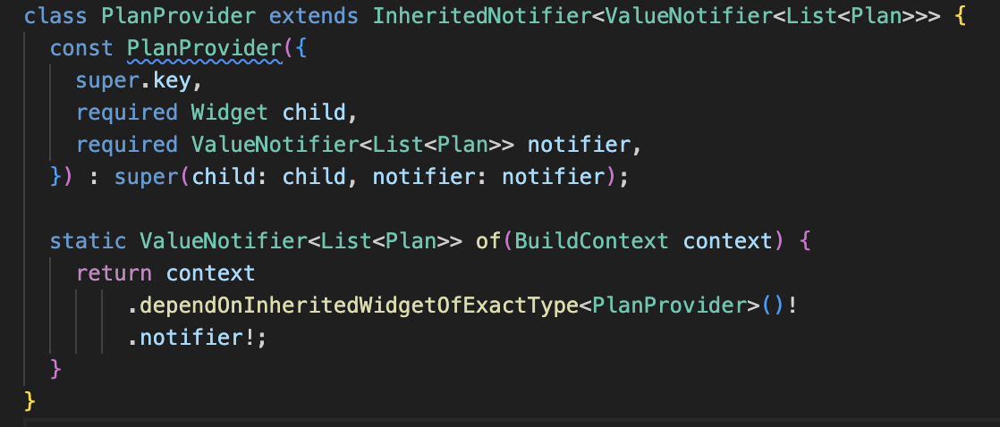

Langkah sebelummnya menyebabkan main.dart terjadi error jadi kita ubah kode di main.dart seperti berikut 
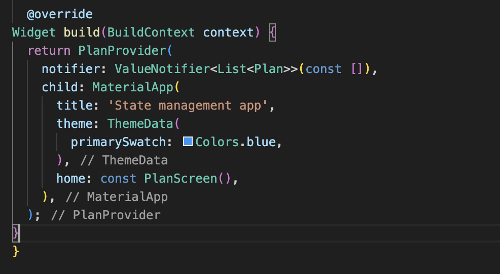

Mengedit plan_screen.dart, menambahkan variabel plan dan atribut pada constructor-nya 
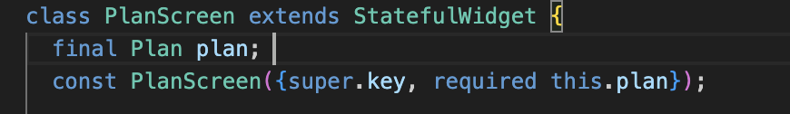

Menambahkan getter pada _PlanScreenState
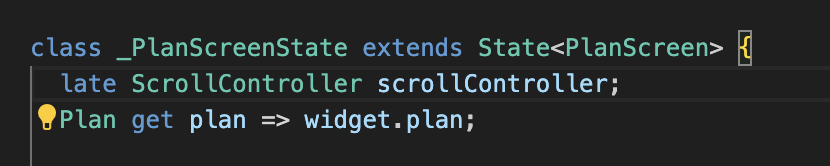

Merubah ke List dan mengubah nilai pada currentPlan 
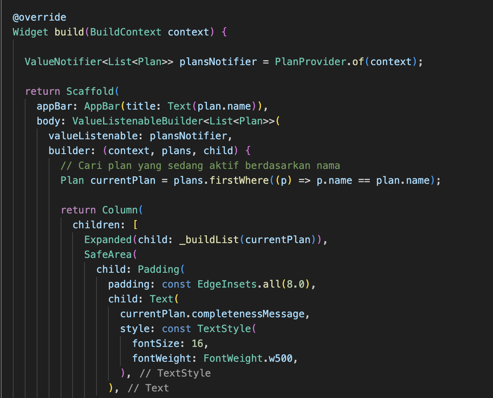

Pastikan ubah ke List dan variabel planNotifier
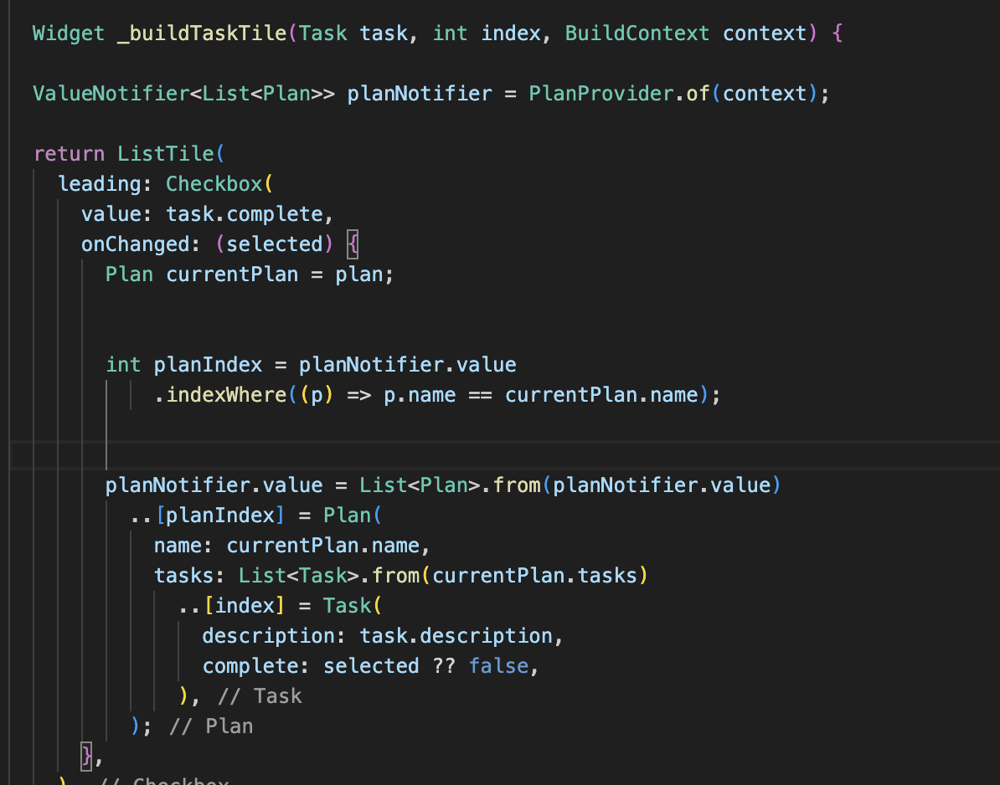

Pada folder view membuat file plan_creator_screen.dart, dan deklarasikan dengan StatefulWidget bernama PlanCreatorScreen
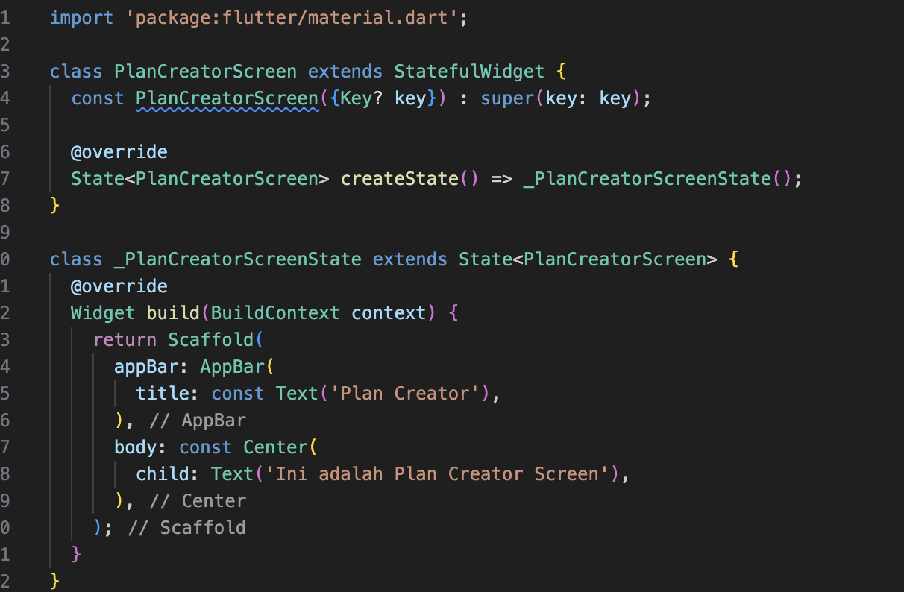

variabel TextEditingController sehingga bisa membuat TextField sederhana untuk menambah Plan baru. 
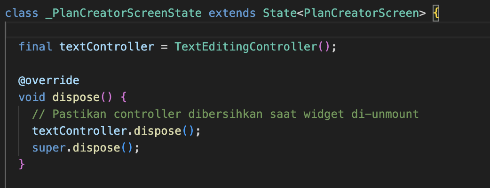

Meletakkan method Widget build berikut di atas void dispose
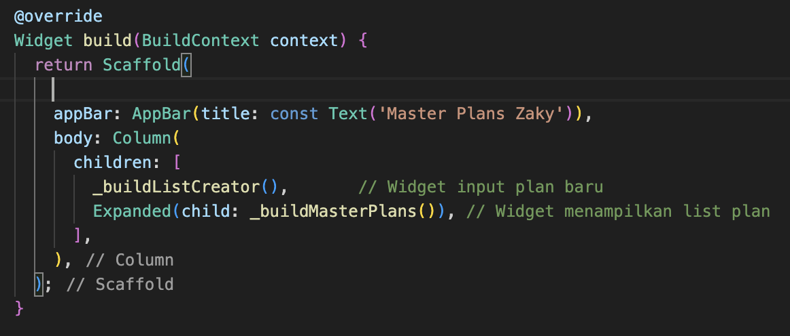

Membuat widget _buildListCreator

Membuat void addPlan()
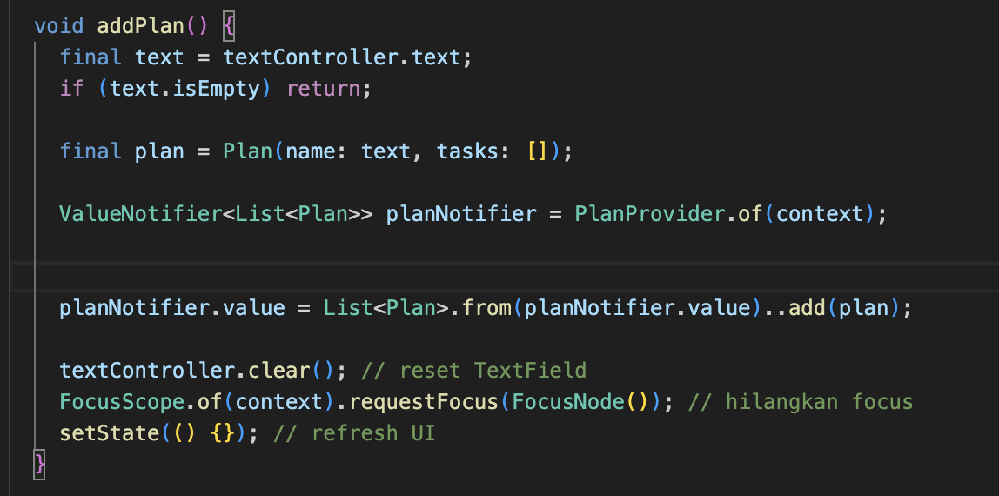

buat widget _buildMasterPlans() yang menampilkan daftar plan dari PlanProvider. Jika list plan kosong, ditampilkan icon dan teks pemberitahuan, kalau ada plan ditampilkan dengan ListView.builder.
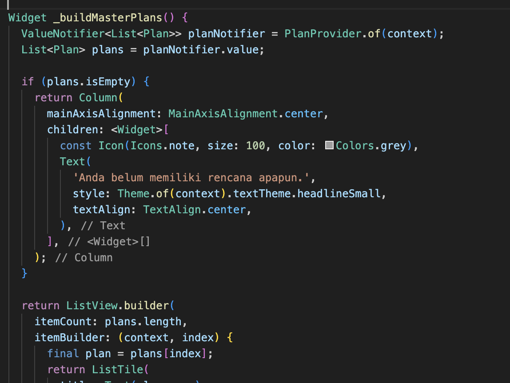

# Tugas Praktikum 3 

1. Selesaikan langkah-langkah praktikum tersebut, lalu dokumentasikan berupa GIF hasil akhir praktikum beserta penjelasannya di file README.md! Jika Anda menemukan ada yang error atau tidak berjalan dengan baik, silakan diperbaiki sesuai dengan tujuan aplikasi tersebut dibuat.
2. Berdasarkan Praktikum 3 yang telah Anda lakukan, jelaskan maksud dari gambar diagram berikut ini! diagram menjelaskan aliran state management 
PlanProvider menyimpan state plan.

PlanCreatorScreen bisa membaca/mengubah state.

Saat user klik plan, navigasi ke PlanScreen tetap bisa mengakses state yang sama melalui PlanProvider.

3. Lakukan capture hasil dari Langkah 14 berupa GIF, kemudian jelaskan apa yang telah Anda buat! 
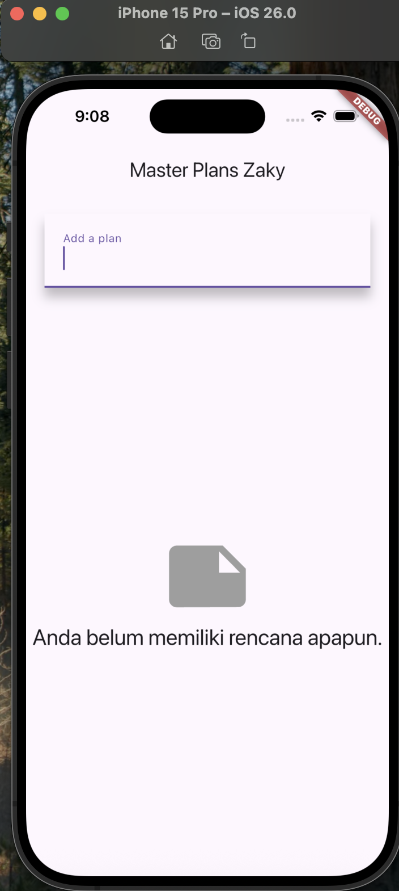
User bisa menambahkan plan melalui TextField di PlanCreatorScreen.

Plan yang ditambahkan langsung muncul di ListView.

Saat user klik salah satu plan, navigasi ke PlanScreen tetap menampilkan data yang sama karena state dikelola oleh PlanProvider.
4. Kumpulkan laporan praktikum Anda berupa link commit atau repository GitHub ke dosen yang telah disepakati !

